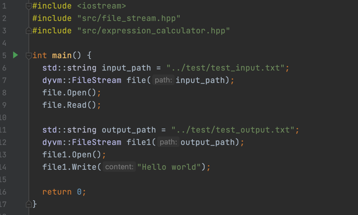
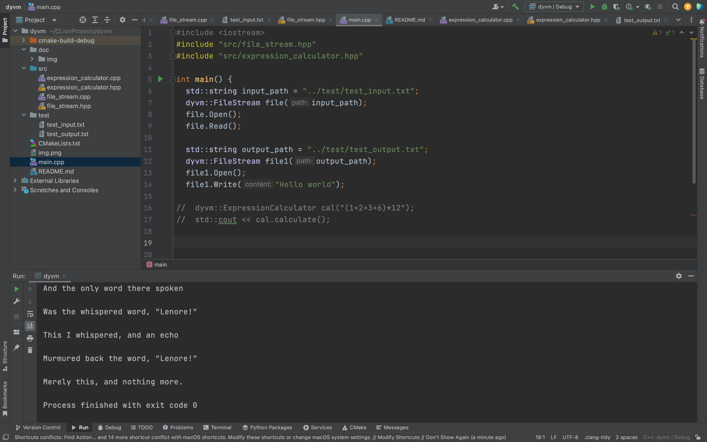
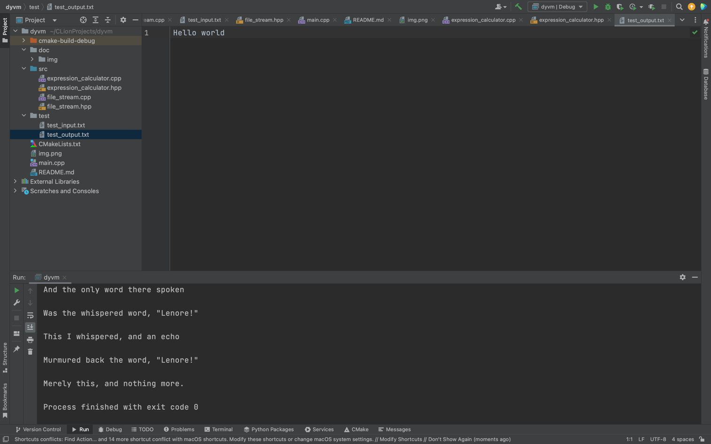
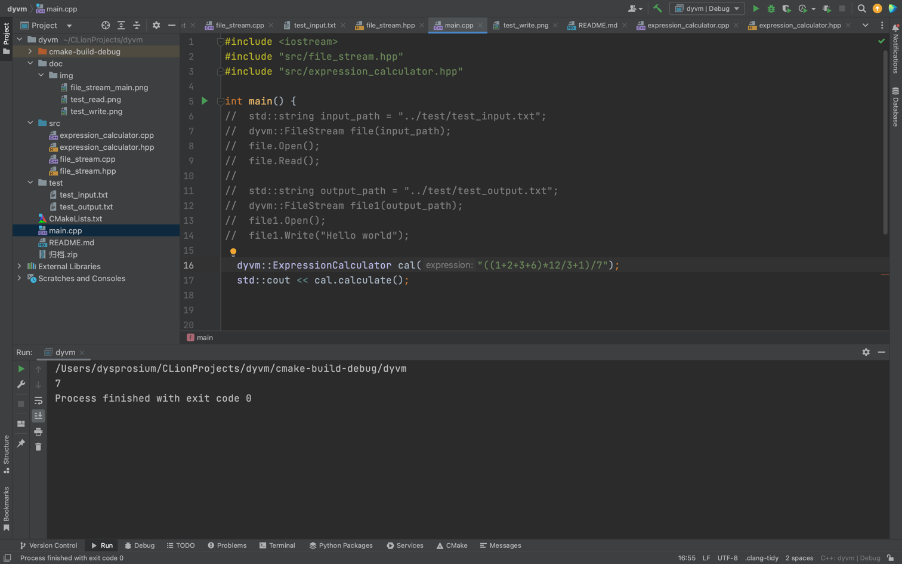
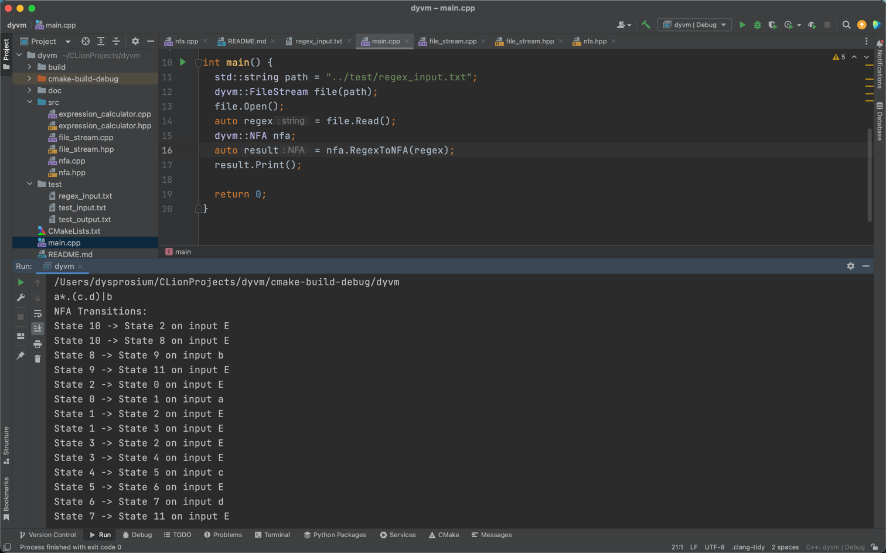
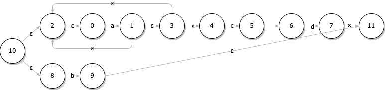
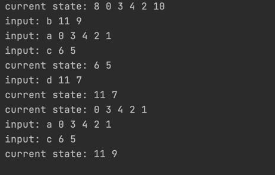
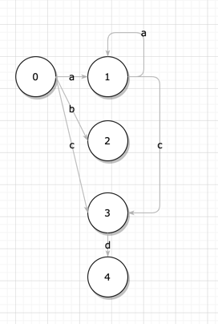
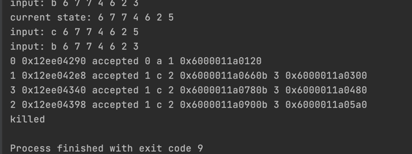

# dyvm: a toy compiler made for the Compiler Principle

This toy compiler call **dyvm** is mainly maintained by **dysprosium** as the project for the Compiler Principle in 2023
Spring.

# Building

This project supports [CMake](https://cmake.org/) out of the box.

## Build for Linux or macOS(Recommended)

Quick start:

```shell
mkdir -p build && cd build
cmake ..
./dyvm
```

## Building for Windows

First generate the Visual Studio 2017 project/solution files:

```shell
mkdir build
cd build
cmake -G "Visual Studio 15" ..
```

The default will build for x86. For 64-bit run:

```shell
cmake -G "Visual Studio 15 Win64" ..
```

Please see the CMake documentation and CMakeLists.txt for more advanced usage.

## 题目1.1 文件的读入与写出

在本题中，`src/file_stream.hpp`和`src/file_stream.cpp`为主要的工程文件，在这两个文件中构建了一个FileStream类负责文件的读写操作。
在`main.cpp`中构建了一段测试代码，在主函数中实现了文件的读写操作。

可以看到，在运行之后读取了在相对路径`../test/test_input.txt`中的内容。

可以看到，在运行之后向相对路径`../test/test_output.txt`的文件中写入了`Hello World`。



## 题目1.2 算术表达式求值
在本题中，`src/expression_calculator.hpp`和`src/expression_calculator.cpp`为主要的工程文件，在这两个文件中构建了一个ExpressionCalculator类负责中缀表达式值的计算。
在`main.cpp`中构建了一段测试代码，在主函数中实现了中缀表达式的计算。

可以看到成功计算出由整数和加减乘除左右括号组成的中缀表达式的值。

## 题目2.1 正则表达式的识别 && 题目2.3 正则表达式转换为NFA
由于对于正则表达式的识别这个标题我不理解最终的输出格式，于是我直接将正则表达式转化成NFA。最终的输入输出如图所示。
主要的工程文件为`src/nfa.hpp`和`src/nfa.cpp`
在`main.cpp`中构建了一段测试代码，实现了从`./test/regex-input.txt`中读取正则表达式，并将其转化为NFA后输出的效果。
正则表达式为a*.(c.d)|b，最终转化的NFA以及在命令行中输出转化表如下所示。




## 题目2.5 NFA到DFA转换
主要的工程文件为`src/dfa.hpp`和`src/dfa.cpp`
在`main.cpp`中构建了一段测试代码，实现了从NFA转化为DFA的过程，在这个过程中，首先求出起始节点的Epsilon闭包，并对后续每个结点分别求Epsilon闭包，直到所有的DFA结点不再有Epsilon闭包为止。

从途中可以看到，我们求出了之前NFA所对应的DFA：



##
主要的工程文件为`src/dfa.hpp`和`src/dfa.cpp`，并且在2.5的基础之上增加`void MinimizeDFA()`函数
在`main.cpp`中最后通过这个函数将DFA最小化，最后结果在终端中输出，可以看见，原来5个DFA状态被重新分为了4个DFA状态。
